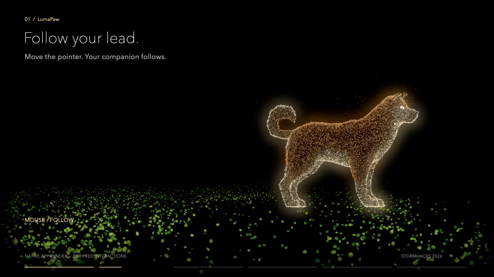

# LumaPaw

A playful, glowing pup for your Mac, inspired by your dog's photo. Pet it, guide it with gestures, or call it over with your voice.

Built solo at **StormHacks 2026** by **Cater Dai**.



## Try it

**[Download the Mac app](https://github.com/Caterrr/LumaPaw/releases/latest)** · [中文说明](README.zh-CN.md) · [Devpost](https://devpost.com/software/lumapaw)

Requires an **Apple silicon Mac (M1 or later), macOS 14 or later**. No development tools or API key are needed to use the downloaded app.

1. Download `LumaPaw-macOS-55.0.zip` from Releases and unzip it.
2. Move `LumaPaw.app` to Applications, then open it.
3. Click **Start** and try the mouse controls first.
4. Choose the hand or microphone icon for gestures or English voice commands. Allow camera or microphone/speech access when requested.

This is a hackathon development build, without Apple notarization. If macOS blocks the first launch, use **System Settings → Privacy & Security → Open Anyway** for this app, then confirm **Open**.

## Play with LumaPaw

| Mode | Interaction |
| --- | --- |
| Mouse | Move the pointer to guide the pup. Press and hold on it to pet. |
| Hand | Point to guide it; show an open palm to pet it. |
| Voice | Try “Luma”, “Come here”, “Sit”, “Spin”, or “Good boy”. |

The tennis ball icon starts fetch. The paw icon changes the dog. The photo icon imports a dog photo, and the sliders adjust appearance. Press **Escape** to return Home.

Only one input mode runs at a time. Camera and microphone are off on Home. Photo customization adapts appearance to the available models; it does not reconstruct an arbitrary dog in 3D.

Hold a mouse pet or hand pet for two seconds to make the pup sit and show hearts. Release to let it stand again.

## Demo

The release also includes a 54-second demo, `LumaPaw-Demo.mp4`. It was recorded from the earlier v49 build and does not show every v55 change. It shows the app's renderer and scripted interaction inputs. It is not a live camera or microphone recording.

## Source and build

`Sources/` contains the Swift application and Metal shaders from release 55.0. The runtime uses AppKit, Metal, Vision, AVFoundation, and Speech. TouchDesigner was used during visual development; the downloaded app runs independently.

Large model, animation, audio, and scene resources are inside the app download rather than in Git history. Original model-authoring files, personal photos, signing settings, backups, and unrelated coursework are not included.

To build locally, install Xcode's Command Line Tools and Python 3, download and unzip the app release, then run on an Apple silicon Mac:

```sh
python3 scripts/build.py --app "/path/to/LumaPaw.app"
open build/LumaPaw.app
```

The build script reuses the downloaded app's resources and compiles the checked-in Swift code and shaders into a separate local build. Use `--identity "YOUR CODE SIGNING IDENTITY"` to sign with your own identity; otherwise it uses ad-hoc signing. Camera and speech permissions may need to be granted again after rebuilding.

## Credits

- Base Shiba Inu and original animations: **Quaternius**, [Shiba Inu on Poly Pizza](https://poly.pizza/m/y4wdQpg767), **CC0 1.0**. The project adds particle rendering, appearance adaptation, and interaction animations.
- Meadow scenery: **aaahhh**, [Fiets_Park](https://superspl.at/scene/e23af0a4), **CC BY 4.0**. Colors and ground particles were adapted for this project.
- Additional dog models and SFU scene material were supplied during development. Original model-authoring files are not in this repository.
- Demo music is original synthesized music made for this project. Existing app audio credits are included with the download.
- **OpenAI Codex** assisted development; it is not an in-app generative AI service.

See `CREDITS.txt` in the app download for retained audio and asset attribution.
